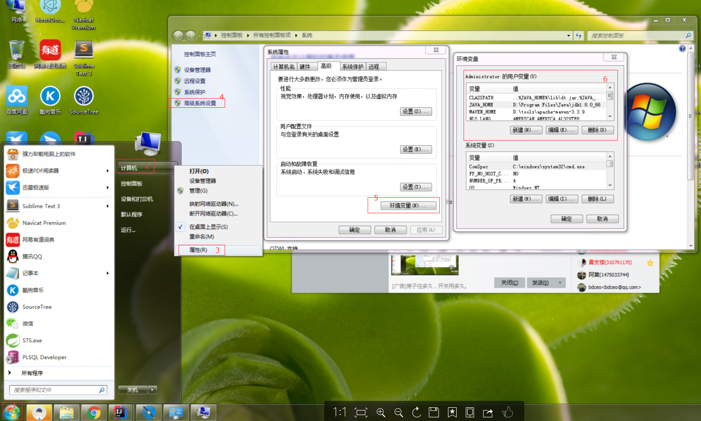

# WINDOWS下搭建开发环境

>该开发环境的搭建，主要针对于WINDOWS7 64位机器下的JAVA后端开发。<br>
>如果喜欢用IDEA作为JAVA的开发工具，建议安装jdk8。

### 1、JAVA安装与环境变量配置

* 安装过程略过（建议安装在D盘）
* JAVA的环境变量配置：

    ```tex
    ①在系统左下角点击“开始”按钮；
    ②找的“计算机”右键选择“属性”；
    ③在弹出的窗口中点击“高级设置”；
    ④在弹出的“系统属性”的“高级”下
    ⑤点击“环境变量”
    ```
    
    如图：



* 添加环境变量

| 变量名           | 变量值                    |
| ---------------- | ------------------------- |
|    JAVA_HOME  |   D:\Program Files\Java\jdk1.8.0_66  |
|    CLASSPATH  |   .;%JAVA_HOME%\lib\dt.jar;%JAVA_HOME%\lib\tools.jar;  |
|    path    |  %JAVA_HOME%\bin;%JAVA_HOME%\jre\bin;  |

* 按下Win(Ctrl和Alt之间的键)+R，然后输入CMD打开命令提示符窗口，输入以下命令验证环境配置是否正确

    ```bash
    java -version
    ```

### 2、MAVEN安装与环境变量配置

* 先下载[MAVEN](http://maven.apache.org/download.cgi)压缩包，解压到硬盘（建议放到D盘）。

* 修改 `settings.xml` 配置文件

  * 指定资源路径

    ```xml
    <localRepository>D:/tools/java/maven-repo</localRepository>
    ```

  * 设置国内镜像

    ```xml
    <mirror>
        <id>alimaven</id>
        <name>aliyun maven</name>
        <url>http://maven.aliyun.com/nexus/content/groups/public/</url>
        <mirrorOf>central</mirrorOf>
    </mirror>
    ```

* 添加环境变量

| 变量名           | 变量值                    |
| --------------- | ------------------------ |
| MAVEN_HOME |  D:\tools\java\apache-maven-3.6.3  |
| PATH       | %MAVEN_HOME%\bin  |

### 3、GRADLE 安装与环境变量配置

* 下载 <a herf="https://gradle.org/releases/" target="_blank">**Gradle**</a> 的软件压缩包

* 配置环境变量


| 变量名           | 变量值                    |
| ---------------- | ------------------------- |
| GRADLE_HOME      | D:\tools\java\gradle-6.2  |
| PATH             | %GRADLE_HOME%\bin;        |
| GRADLE_USER_HOME | D:\tools\java\gradle-repo |

  * 验证是否配置成功
  
    ```bash
    gradle -v
    ```

### 4、NODE.js安装与环境变量配置

* 下现在安装包[node-v6.11.1-x64](https://nodejs.org/dist/v6.11.1/node-v6.11.1-x64.msi)（安装的时候，默认设置了环境变量，可以略过下一步）;
* 其他配置可参照[快速搭建 Node.js 开发环境以及加速 npm](https://cnodejs.org/topic/5338c5db7cbade005b023c98)

* 安装gulp插件

  ```bash
  npm install -g gulp --registry=https://registry.npm.taobao.org
  ```

* 更换 **npm** 源，加速软件包的安装

  ```bash
  # 查看 npm 配置信息
  npm config list
  # 修改 registry 地址为淘宝镜像源
  npm config set registry https://registry.npm.taobao.org/
  ```

### 5、MYSQL安装配置

下载压缩包的版本[mysql5.6]()，解压到硬盘（这里解压的D盘）；

### 6、安装 VS Code


## 7、安装 Git 版本控制工具

* 下载安装 [Git](https://git-scm.com/download/win) 客户端

## 8、IDEA 的使用配置

1. 安装常用插件

   * Alibaba Java Coding Guidelines（阿里的代码规范插件）
   * Lombok
   * Maven Helper
   * Translation（翻译插件）
   * CodeGlance （代码地图）

2. 修改 `Terminal` 的默认命令行工具，使用 `git-bash`，操作如下：

   打开设置面板 `File` > `Settings` > `Tools` > `Terminal` ，在 `Shell path` 一栏中，输入你主机 `Git Bash`的安装位置 

   ```bash
   "C:\Program Files\Git\bin\sh.exe" -login -i
   ```

3. 添加文件的默认注释信息

   打开设置面板 `File` > `Settings` > `Editor` > `File and Code Templates` ，点击 `Includes` 标签的 `File Header` 选项，输入注释信息，如下

   ```java
   /**
    * 
    * @author ${USER}
    * @createdAt ${DATE} ${TIME}
    */
   ```

   

## 9、WIN7 下 docker 的使用

* 下载并安装 **DockerToolbox** ，参考 [Windows下运用Docker部署Node.js开发环境](https://segmentfault.com/a/1190000007955073)

* 设置环境变量（默认情况下 docker 宿主虚拟机的储存目录是在 C 盘）

  `MACHINE_STORAGE_PATH=D:\docker`

* 运行 **Docker Quickstart Terminal** ，提示成功后，即可在命令行中执行 docker 命令