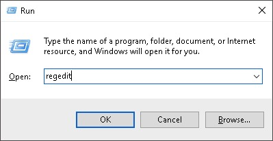
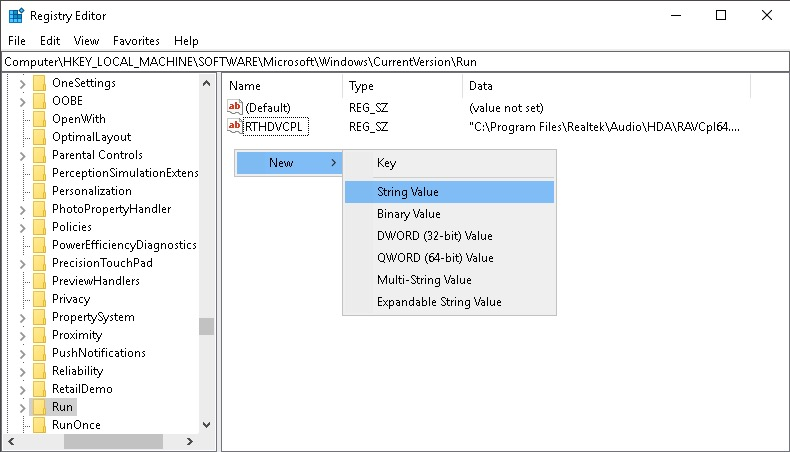

# Windows 的 linux 子系统使用笔记

## 安装 Linux 子系统（Ubuntu/Debian）

* `windows + x` 打开 PowerShell （管理员）命令行工具，执行下列命令

    ```powershell
    dism.exe /online /enable-feature /featurename:Microsoft-Windows-Subsystem-Linux /all /norestart
    dism.exe /online /enable-feature /featurename:VirtualMachinePlatform /all /norestart
    ```

* 重启电脑，然后在 **Microsoft Store** 中找到 **Ubuntu** ，并下载安装。

* 第一次启动 **Ubuntu** 会创建一个用户

    > 如果要把 wsl 切换到 2 ，请看 <a href="https://docs.microsoft.com/zh-cn/windows/wsl/wsl2-install" target="_brank">WSL 2 的安装说明</a>

## 设置 root 密码

* 默认情况下 Ubuntu 子系统的 root 账号的密码是动态的，如果需要自己设置，请在 Ubuntu 的命令行中执行以下命令

    ```bash
    sudo passwd
    ```

## 更换软件源

* 备份 `/etc/apt/sources.list` 配置文件

    ```shell
    cd /etc/apt
    sudo cp sources.list sources.list_back
    ```

* 修改 `/etc/apt/sources.list` 配置文件

    [清华大学镜像](https://mirrors.tuna.tsinghua.edu.cn/help/ubuntu/)

    ```shell
    # 默认注释了源码镜像以提高 apt update 速度，如有需要可自行取消注释
    deb https://mirrors.tuna.tsinghua.edu.cn/ubuntu/ bionic main restricted universe multiverse
    # deb-src https://mirrors.tuna.tsinghua.edu.cn/ubuntu/ bionic main restricted universe multiverse
    deb https://mirrors.tuna.tsinghua.edu.cn/ubuntu/ bionic-updates main restricted universe multiverse
    # deb-src https://mirrors.tuna.tsinghua.edu.cn/ubuntu/ bionic-updates main restricted universe multiverse
    deb https://mirrors.tuna.tsinghua.edu.cn/ubuntu/ bionic-backports main restricted universe multiverse
    # deb-src https://mirrors.tuna.tsinghua.edu.cn/ubuntu/ bionic-backports main restricted universe multiverse
    deb https://mirrors.tuna.tsinghua.edu.cn/ubuntu/ bionic-security main restricted universe multiverse
    # deb-src https://mirrors.tuna.tsinghua.edu.cn/ubuntu/ bionic-security main restricted universe multiverse
    
    # 预发布软件源，不建议启用
    # deb https://mirrors.tuna.tsinghua.edu.cn/ubuntu/ bionic-proposed main restricted universe multiverse
    # deb-src https://mirrors.tuna.tsinghua.edu.cn/ubuntu/ bionic-proposed main restricted universe multiverse
    ```

* 更新源，使配置生效

    ```shell
    sudo apt-get update
    ```

## 安装 Redis

1. 下载压缩包安装的方式

    * 安装必要的软件包

        ```shell
        sudo apt install make build-essential
        ```

    * 下载压缩包（从[官网](https://redis.io/)获取下载地址）

        ```shell
        wget http://download.redis.io/releases/redis-5.0.7.tar.gz
        ```
    
    * 解压文件，并编译软件

        ```shell
        tar -xf redis-5.0.7.tar.gz
        cd redis-5.0.7
        make MALLOC=libc
        ```

    * 安装软件

        ```shell
        make install
        ```

    

2. 直接通过 apt-get 安装

    ```bash
    sudo apt-get install redis-server
    ```

## Docker 的安装与卸载

* 安装 Docker

    > wsl 的版本必须是 2，否则 Docker 无法正常使用 

    1. 更新 apt 源索引

       ```shell
       sudo apt-get update
       ```

    2. 安装包允许apt通过HTTPS使用仓库

       ```shell
       sudo apt-get install \
           apt-transport-https \
           ca-certificates \
           curl \
           gnupg-agent \
           software-properties-common
       ```

    3. 添加Docker官方GPG key

       ```shell
       curl -fsSL https://download.docker.com/linux/ubuntu/gpg | sudo apt-key add -
       ```

    4. 设置 Docker 稳定版仓库

       ```shell
       sudo add-apt-repository \
          "deb [arch=amd64] https://download.docker.com/linux/ubuntu \
          $(lsb_release -cs) \
          stable"
       ```

    5. 更新 apt 源索引

       ```shell
       sudo apt-get update
       ```

    6. 安装最新版本 **Docker CE**（社区版）

       ```shell
       sudo apt-get install docker-ce docker-ce-cli containerd.io
       ```

    7. 查看安装Docker的版本

       ```shell
       docker -v
       ```

    8. 验证 Docker CE 是否安装正确

       ```shell
       sudo docker run hello-world
       ```

        > Docker 修改命令请查看 [DOCKRE 使用笔记](../linux/docker_usr_notes.md)

* 卸载 Docker-ce

  1. 卸载 Docker-ce 软件包

     ```shell
     sudo apt-get purge docker-ce
     ```

  2. 主机上的映像，容器，卷或自定义配置文件不会自动删除。要删除所有图像，容器和卷：

     ```shell
     sudo rm -rf /var/lib/docker
     ```

## WSL 服务自启动脚本

支持在Windows启动时启动WSL中的Linux服务。

### 安装

* 使用 git clone 到任意目录 (e.g `C:\wsl-autostart`)

    ```shell
    git clone https://github.com/troytse/wsl-autostart
    ```

* 在注册表中加入启动项



* 在`HKEY_LOCAL_MACHINE\SOFTWARE\Microsoft\Windows\CurrentVersion\Run`下新增字符串项目 (e.g `WSLAutostart`)



* 设定脚本的路径 (e.g `C:\wsl-autostart\start.vbs`)


### 使用

* 修改在WSL中`/etc/sudoers`文件,为需要自启动的服务指定为免密码。如:

  ``` sudoers
    %sudo ALL=NOPASSWD: /etc/init.d/redis_6379
  ```
  
* 修改`commands.txt`文件指定需要自启动的服务。如:

  ```shell
    /etc/init.d/redis_6379
  ```
